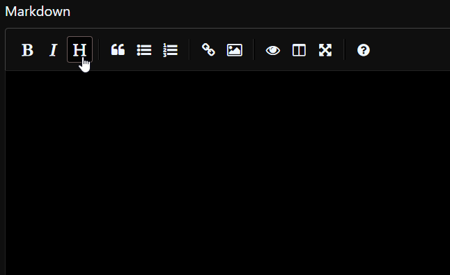
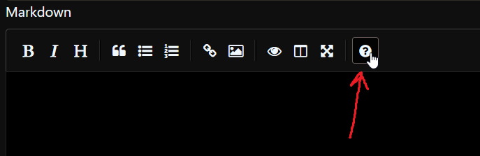

# <font color="darkcyan">Dell EBIA Wiki</font>

## <font color="#32cd32">Project Details</font>

- Author : Kapil P Deshmukh

- Mentor : Sujith Ravindran

- For : Summer Internship @ Dell, Bengaluru

- Start Date : 7th June 2021

- Last Update : 15th July 2021

- Main Website URL : [ebia-wiki-dell.herokuapp.com](https://ebia-wiki-dell.herokuapp.com)

- Admin Dashboard URL : [dell-ebia-admin.herokuapp.com](https://dell-ebia-admin.herokuapp.com)

- Application Logo : Represents reflection, integrity and nature.

## <font color="red">Abstract</font>

The project titled <font color="#32cd32">“Dell EBIA Wiki”</font> was designed to create, document and store articles in order to consolidate the knowledge of the department. By having a unified environment to share information, it would be of great help for the new members as well as seasoned veterans here at Dell EBIA. The goal is to have a web based application where the pros who have gathered deep insight about the ins-and-outs of the day-to-day work culture, protocols, terminologies and products - can share all of this valuable knowledge with the rookies who are getting started, or anyone looking to enhance their cross functional knowledge.

<font color="darkcyan">Administrators</font>, who have complete access to create, edit, delete articles can go about doing so according to their own discretion and the time of creation will be time stamped once the article has been issued.

<font color="goldenrod">Users</font>, who are authorized personnel within Dell, can view the articles and get shareable links that can be forwarded to other users/admins.

<font color="crimson">Outsiders</font>, unknown or anonymous entities that have not been authorized by the admins cannot view any article, making this internal documentation classified and viewable only by the employees under Dell.

Each feature within the Application(s) has been designed with maximum security and safety in mind, so as to deter any sorts of unauthorized sharing of articles and the information contained within them.

<!-- This readme highlights some of the major features of the project and aims to inform the users about how to go about interacting with the Web App i.e. the Authorization, Role Management Systems, Content Management Systems, etc. At the end of this document, some additional technical specifications and specifics can be found pertaining to the Dell EBIA Wiki and its sister app Dell EBIA Admin (Role Management) -->

# Quickstart Guide

## [Click here for the Main Article on the Website](https://ebia-wiki-dell.herokuapp.com/docs)


<hr>
<hr>

## [Markdown Quickstart Guide (Abrdidged)](yellow)

### [_Table of Contents_](red)

1. <a href="#heading">Heading</a>
2. <a href="#normal-text">Normal Text</a>
3. <a href="#colored-text">Colored Text</a>
4. <a href="#bold-italics-and-other-emphasis">Bold, Italics and Other Emphasis</a>
5. <a href="#lists">Lists</a>
6. <a href="#links">Links</a>
7. <a href="#images">Images</a>

- <a href="#glossary">Additional Markdown Glossary</a>

<hr>
<hr>

[Note Before](red) : This guide is shortened in the interest of ease of use.

If you wish to view the full, comprehensive Guide to Markdown Formatting, click here :

<a href="https://www.markdownguide.org/basic-syntax/" target="_blank" class="btn btn-info">Full Markdown Guide</a>

<hr>
<hr>

## [Heading](#heading)

Adding Headings to your markdown article is very straightforward. <br>
We have in all 6 types of headings at our disposal :

| [Heading type](blue) | [Prefix](yellow) |
| -------------------- | ---------------- |
| h1                   | #                |
| h2                   | ##               |
| h3                   | ###              |
| h4                   | ####             |
| h5                   | #####            |
| h6                   | ######           |

<hr>

### [Examples](red)

```
# Heading1
```

# Heading1

```
#### Heading4
```

#### Heading4

[Note](yellow) : You can additionally add Headings via the toolbar :



<hr>
<hr>

## [Normal Text](#normal-text)

Normal Text is extemely straightforward.
Simply write what you wish to in the text editor.

To add line breaks, simply leave a line in between or add [\<br>](yellow) between lines

<hr>

### [Example](red)

```
This is the first Line.
This line will follows the previous.

This is the second Line.

This line will be on the next line of second.

This is the fourth Line. <br> This line forcefully breaks from the fourth
```

This is the first Line.
This line will follow the previous.

This is the second Line.

This line will be on the next line of second.

This is the fourth Line. <br> This line forcefully breaks from the fourth

<hr>
<hr>

### [Colored Text](#coloredtext)

You can color any text (headings, normal text, lists, etc) [in](blue) [many](red) [different](yellow) [colors](green).

Here is an ever expanding list of Colors. (We keep adding more colors all the time.)

| colorName | Sample Text                                |
| --------- | ------------------------------------------ |
| _red_     | <font color="crimson">Lorem Ipsum</font>   |
| _green_   | <font color="green">Lorem Ipsum</font>     |
| _blue_    | <font color="darkcyan">Lorem Ipsum</font>  |
| _yellow_  | <font color="goldenrod">Lorem Ipsum</font> |
| _purple_  | <font color="purple">Lorem Ipsum</font>    |

<br>
To Apply the color, follow this syntax

```
[Text that you want to display](colorName)
```

<hr>

### [Example](red)

```
[This is Sample Text, red in color](red)
```

[This is Sample Text, red in color](red)

```
##### [This is a Heading5, purple in color](purple)
```

##### [This is a Heading5, purple in color](purple)

<hr>
<hr>

### [Bold, Italics and Other Emphasis](#emphasis)

You can emphasise text using **Bold**, _Italics_, **_Combination_** and ~~Strike Through.~~

<hr>

### [Examples](red)

```
Emphasis, aka italics, with *asterisks* or _underscores_.

Strong emphasis, aka bold, with **asterisks** or **underscores**.

Combined emphasis with **asterisks and _underscores_**.

Strikethrough uses two tildes. ~~Scratch this.~~

```

Emphasis, aka italics, with _asterisks_ or _underscores_.

Strong emphasis, aka bold, with **asterisks** or **underscores**.

Combined emphasis with **asterisks and _underscores_**.

Strikethrough uses two tildes. ~~Scratch this.~~

<hr>
<hr>

### [Lists](#lists)

### [Example](red)

```
1. First ordered list item
2. Another item
3. And another item.


* Unordered list can use asterisks
- Or minuses
+ Or pluses
```

1. First ordered list item
2. Another item
3. And another item.

- Unordered list can use asterisks

* Or minuses

- Or pluses

<hr>
<hr>

### [Links](#links)

Markdown makes linking to other Websites, Articles, Pages and Media extremely simple.

All you have to is follow this basic syntax:

```
[Text You want to Show](websiteYouWantToLink.com)
```

<hr>

### [Example](red)

```
[Click to See a Good Boy](https://bit.ly/veryfastgoodboy)
```

[Click to See a Good Boy](https://bit.ly/veryfastgoodboy)

<hr>
<hr>

### [Images](#images)

Inserting Images is very similar to Links.

Follow the following simple syntax:

```

```

Additionally you can add titles of ["medium_big"](yellow) and ["big_img"](red) to get images that are [70%](yellow) and [95%](red) of the article in width, respectively.

[Note : ](yellow) Images will automatically fit to accomodate screen sizes on Mobile

<hr>

### [Example](red)

_[Standard Image Example](blue)_

```

```


_[For Medium Image Example Click Here](https://ebia-wiki-dell.herokuapp.com/docs#images)_

_[For Large Image Example Click Here](https://ebia-wiki-dell.herokuapp.com/docs#images)_

<hr>
<hr>

# [Glossary](green)

While writing an article, you always access [Markdown Basic Syntax Guide]() by clicking on the "❔"



#### [Additional References](purple)

- ##### [ Phenomenal Cheat-Sheet on Github by AdamP](https://github.com/adam-p/markdown-here/wiki/Markdown-Cheatsheet)
- ##### [ Markdown Guide by Matt Cone](https://www.markdownguide.org/)
- ##### [ Markdown's Original Website](https://daringfireball.net/projects/markdown/)
- ##### [ Wikipedia : Markdown](https://en.wikipedia.org/wiki/Markdown)
