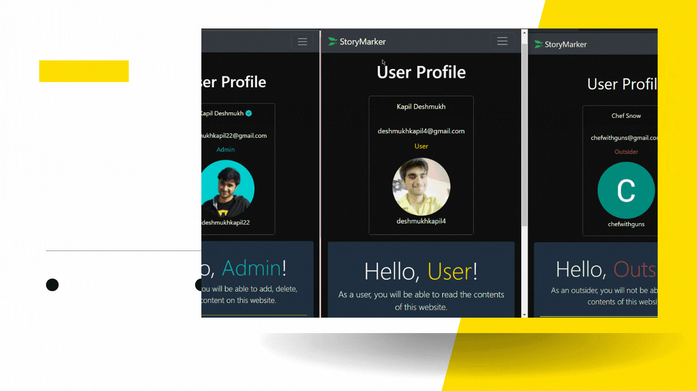

<div id="top"></div>

<!-- PROJECT LOGO -->
<br />
<div align="center">
  <a href="https://github.com/KaProDes/storymarker/about">
    
  </a>
  <h3 align="center">StoryMarker</h3>

  <p align="center">
    Made for small teams to internally share designs, mockups and code.
    <br />
    <a href="https://github.com/KaProDes/storymarker/tree/master/source"><strong>Jump to Project Source »</strong></a>
    <br />
    <br />
    <a href="https://storymarker.herokuapp.com/about">View Demo</a>
    ·
    <a href="https://github.com/KaProDes/storymarker/issues">Report Bug</a>
    ·
    <a href="https://github.com/KaProDes/storymarker/issues">Request Feature</a>
  </p>
</div>

<!-- TABLE OF CONTENTS -->

<summary>Table of Contents</summary>
<ol>
  <li>
    <a href="#about-the-project">About The Project</a>
    <ul>
      <li><a href="#built-with">Built With</a></li>
    </ul>
  </li>
  <li>
    <a href="#getting-started">Getting Started</a>
    <ul>
      <li><a href="#prerequisites">Prerequisites</a></li>
      <li><a href="#installation">Installation</a></li>
    </ul>
  </li>
  <li><a href="#contributing">Contributing</a></li>
  <li><a href="#license">License</a></li>
  <li><a href="#contact">Contact</a></li>
  <li><a href="#acknowledgments">Acknowledgments</a></li>
</ol>

<!-- ABOUT THE PROJECT -->

## About The Project


While working on an App Idea with a small-medium team, it often gets tedious to haul code snippets around, write todos for features, distribute mockups and track progress of the UI/UX development. StoryMarker allows you to do all of the above, so that you can work on the next big thing without losing track of _that_ Figma Design that Eve shared with you last Thursday!

Features of StoryMarker:

-   Rich Text Editor with Markdown support so that you can write Stories with maximum control.
-   auth0 Authentication with customizable Role control \(Admin/User/Others\)
-   Created by Software Engineers like you. We have painstakingly created a beautiful seamless, familiar-feeling experience using Bootstrap 5 that doesn't get in the way <a href="https://clutch.co/web-designers/resources/why-bootstrap-is-ideal-design-framework">Know More »</a>

Building a collaboration software is a continuous process and requires iterative improvements and matures over time. We will be updating the features on the backend per the issues/user feedback and we aim to make StoryMarker an essential tool in a small Team's arsenal

Authorization Features :



Visit <a href="https://storymarker.herokuapp.com/about">StoryMarker</a> to check it out now!

<p align="right">(<a href="#top">back to top</a>)</p>

### Built With

This project is made with :

-   [Bootstrap 5](https://getbootstrap.com)
-   [Node JS](https://nodejs.org/)
-   [Express JS](https://expressjs.com/)
-   [Marked](https://www.npmjs.com/package/marked)
-   [Mongo DB](https://www.mongodb.com/)
-   [ejs](https://ejs.co/)
-   [auth0](https://auth0.com/)

<p align="right">(<a href="#top">back to top</a>)</p>

<!-- GETTING STARTED -->

## Getting Started

Before you start working on this project/fork it, it is highly recommended that you check out how the models and the backend works here : [Source](https://github.com/KaProDes/storymarker)

We can clone the entire project
To get a local copy up and running follow these simple example steps.

### Prerequisites

This is an example of how to list things you need to use the software and how to install them.

-   NodeJS version 14 or greater
    ```sh
    node -v
    ```

### Installation

_Below is an example of how you can instruct your audience on installing and setting up your app. This template doesn't rely on any external dependencies or services._

1. Clone the repo
    ```sh
    git clone https://github.com/KaProDes/storymarker.git
    ```
2. Install all necessary node modules
    ```sh
    npm install
    ```
3. Create a .env file and add the following
   Do note that you will require your own [MongoDB Instance](https://youtu.be/bxsemcrY4gQ) and [auth0](https://youtu.be/QQwo4E_B0y8) server
    ```.env
    ISSUER_BASE_URL=https://johndoe.us.auth0.com
    CLIENT_ID=FmS123459y0HXpa234xlDZIVElgraY65
    BASE_URL=http://localhost:3000
    SECRET=NbAtMbK2fCkgQ1otjStjClwev2oDnVPTQtomhollandbp37STlIzHFo3Zz3A8CB
    URI=mongodb+srv://johndoe:<password>@cluster0.ifsn5.mongodb.net/Stories?retryWrites=true&w=majority
    ```
4. Launch the Project on default port 3000
    ```sh
    npm run dev
    ```

<p align="right">(<a href="#top">back to top</a>)</p>

<!-- CONTRIBUTING -->

## Contributing

Contributions are what make the open source community such an amazing place to learn, inspire, and create. Any contributions you make are **greatly appreciated**.

If you have a suggestion that would make this better, please fork the repo and create a pull request. You can also simply open an issue with the tag "enhancement".
Don't forget to give the project a star! Thanks again!

1. Fork the Project
2. Create your Feature Branch (`git checkout -b feature/AmazingFeature`)
3. Commit your Changes (`git commit -m 'Add some AmazingFeature'`)
4. Push to the Branch (`git push origin feature/AmazingFeature`)
5. Open a Pull Request

<p align="right">(<a href="#top">back to top</a>)</p>

<!-- LICENSE -->

## License

I, KaProDes, give anyone and everyone the freedom to use this Project. Free to use. Credits appreciated.

<p align="right">(<a href="#top">back to top</a>)</p>

<!-- CONTACT -->

## Contact

Your Name - [@KapProDes](https://leetcode.com/KapProDes/) - deshmukhkapil4@gmail.com

Project Link: [https://github.com/KaProDes/storymarker](https://github.com/KaProDes/storymarker)

<p align="right">(<a href="#top">back to top</a>)</p>

<!-- ACKNOWLEDGMENTS -->

## Acknowledgments

Special thanks to all my teachers and mentors. I have made this project as part of my practical learning.

-   [Colt Steele](https://github.com/Colt)
-   [CodeDamn](https://www.youtube.com/c/codedamn)
-   [CodeStackr](https://www.youtube.com/c/codeSTACKr)
-   [freecodecamp](https://www.youtube.com/c/Freecodecamp)

<p align="right">(<a href="#top">back to top</a>)</p>
